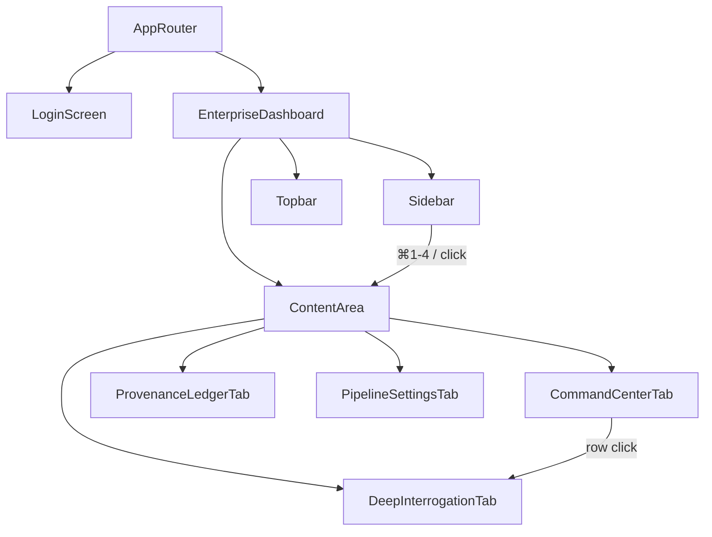

# Design Document: UI Improvements — AXIOM Enterprise SOC Portal

## Overview

This design covers seven targeted improvements to the AXIOM SOC Portal frontend. The codebase is a single-file Next.js 16 / React 19 application (`frontend/src/app/page.tsx`) with a CSS custom-property design system in `globals.css`. All changes stay within that file and its stylesheet — no new routes, no new packages beyond what is already installed (`framer-motion`, `lucide-react`).

The improvements fall into three categories:

1. **Navigation** — keyboard shortcuts, active-state fidelity, analyst identity in sidebar, AXIOM › breadcrumb in topbar, theme toggle persistence.
2. **Visual consistency** — enforce design-token-only styling, standardise `.panel` / `.panel-header` / `.status-badge` / `.kpi-card` usage across all tabs.
3. **Tab content** — populate the currently empty Deep Interrogation and Pipeline Settings tabs; enhance Command Center (4th KPI, clickable rows, FRAUD HIT tinting, Refresh Feed); add expandable rows + pagination to Provenance Ledger.

### Key Constraints

- No new npm dependencies.
- All colours, borders, radii, and shadows must reference CSS custom properties from `globals.css`.
- Backend API base: `http://localhost:8000`.
- Relevant endpoints: `GET /api/scrapers/trigger`, `POST /api/interrogate`, `GET /health`.

---

## Architecture

The application remains a single-page client component. State is managed with React `useState` / `useEffect` hooks. No global state library is introduced.



State lifted to `EnterpriseDashboard`:

| State variable | Type | Purpose |
|---|---|---|
| `activeTab` | `string` | Currently visible tab |
| `selectedAsset` | `Asset \| null` | Asset loaded in Deep Interrogation |
| `theme` | `'light' \| 'dark'` | Current theme |
| `feedRows` | `FeedRow[]` | Pipeline event feed data |
| `provenanceRecords` | `ProvenanceRecord[]` | Ledger records |
| `provenancePage` | `number` | Current ledger page |
| `workerStatuses` | `WorkerStatus[]` | Scraper worker states |

---

## Components and Interfaces

### Sidebar

Renders four `NavItem` entries. Each entry carries:
- Icon, label, tab key, keyboard shortcut string (`⌘1`–`⌘4`).
- `active` boolean derived from `activeTab`.

A `useEffect` registers a `keydown` listener on `document` that maps `Meta+1`–`Meta+4` (and `Ctrl+1`–`Ctrl+4` for Windows) to the corresponding tab.

Analyst identity row at the bottom shows the logged-in email (passed as prop from `AppRouter`) and a green status dot.

### Topbar

Receives `activeTab` as a prop. Derives the human-readable module name from a static map:

```ts
const MODULE_NAMES: Record<string, string> = {
  command_center: 'Command Center',
  interrogation: 'Deep Interrogation',
  provenance: 'Provenance Ledger',
  scrapers: 'Pipeline Settings',
};
```

Breadcrumb renders as: `AXIOM › {MODULE_NAMES[activeTab]}`.

Theme toggle button uses `Moon` / `Sun` icons from `lucide-react`.

### CommandCenterTab

- **KPI grid**: 4 cards — Volume Indexed, Cache Intercepts, Critical Incidents, System Latency. System Latency is fetched from `GET /health` (response time measured client-side) or displayed as a static placeholder when the backend is unreachable.
- **Pipeline Event Feed**: table with columns Resource ID, Origin Context, Timestamp, Status, Routing. Each `<tr>` is `cursor: pointer`. Rows with `status === 'FRAUD HIT'` receive `background: rgba(var(--threat-high-rgb), 0.08)` — a new token added to `globals.css`.
- **Refresh Feed** button calls a local `refreshFeed()` function that re-fetches or regenerates mock data.
- Row click sets `selectedAsset` and navigates to `interrogation` tab.

### DeepInterrogationTab

Receives `selectedAsset: Asset | null`.

When `selectedAsset` is null → empty state panel.

When an asset is loaded:

1. **Asset Summary Header** — `.panel` with `.panel-header` "Asset Summary". Displays: Asset ID (monospace), Origin Context, Pipeline Status badge.
2. **Triage Log Panel** — `.panel` with `.panel-header` "Triage Log". Key-value rows: pHash Match Score, aHash Match Score, Audio Fingerprint, Routing Decision.
3. **Gemini Reasoning Panel** — `.panel` with `.panel-header` "Gemini Analysis". Key-value rows: Confidence Score, Classification, Recommended Action, Forensic Signals.
4. **Action Bar** — three `.btn-secondary` / `.btn-primary` buttons: "Issue Takedown", "Archive as False Positive", "Escalate to Tier 2". Takedown triggers a `window.confirm` dialog before calling `POST /api/interrogate`. Archive sets local status to `ARCHIVED` and disables the bar. Errors render inline below the bar.

### PipelineSettingsTab

Three worker cards (YouTube Sync, Reddit Crawler, Telegram Monitor) rendered from a `WORKERS` config array. Each card is a `.panel` with:
- Worker name (`.panel-header`)
- Status badge (`.status-badge` + modifier)
- Last-run timestamp (monospace, `--text-muted`)
- "Invoke Scrape" button

"Invoke All Scrapers" button at the top calls `GET /api/scrapers/trigger` and fans out loading state to all cards simultaneously.

Individual "Invoke Scrape" calls the same endpoint with a `platform` query param (future-proofed; current backend triggers all scrapers regardless).

### ProvenanceLedgerTab

- Record count displayed above table: `{records.length} records`.
- Table columns: Object Hash (SHA-256), C2PA Standard, Issuer, Timestamp, Signature Integrity.
- Each row is clickable. Clicking toggles an `expandedRowId` state. When a row is expanded, a `<tr>` is inserted immediately below it containing a detail panel with: Claim Generator, Signature Issuer, Signing Timestamp, Asset Hash — rendered as a 2-column key-value grid inside a `.panel`.
- Pagination: 20 records per page. Controls render only when `records.length > 20`. Previous / Next buttons + "Page X of Y" label.

---

## Data Models

```ts
type TabKey = 'command_center' | 'interrogation' | 'provenance' | 'scrapers';

interface NavEntry {
  key: TabKey;
  label: string;
  icon: React.ReactNode;
  shortcut: string; // e.g. '⌘1'
}

interface FeedRow {
  id: string;           // e.g. 'vid_xt9918'
  origin: string;       // e.g. 'Reddit Scraper'
  timestamp: string;    // ISO string or display string
  status: 'VERIFIED' | 'FRAUD HIT' | 'PROCESSING' | 'ARCHIVED';
  routing: string;      // e.g. 'L2 Cache Hit'
  triageData?: TriageData;
  geminiData?: GeminiData;
}

interface TriageData {
  pHashScore: string;
  aHashScore: string;
  audioFingerprint: string;
  routingDecision: string;
}

interface GeminiData {
  confidence: string;
  classification: string;
  recommendedAction: string;
  forensicSignals: string[];
}

type Asset = FeedRow; // selected asset is a feed row

interface WorkerStatus {
  id: string;           // 'youtube' | 'reddit' | 'telegram'
  name: string;
  status: 'ACTIVE' | 'IDLE' | 'ERROR';
  lastRun: string;      // display timestamp
  loading: boolean;
  error: string | null;
}

interface ProvenanceRecord {
  hash: string;         // truncated SHA-256
  standard: string;
  issuer: string;
  timestamp: string;
  integrity: 'VALID' | 'INVALID' | 'PENDING';
  // expanded detail fields
  claimGenerator: string;
  signingTimestamp: string;
  assetHash: string;
}
```

New CSS token added to `globals.css` (both themes):

```css
/* light */
--threat-high-rgb: 225, 29, 72;
/* dark */
--threat-high-rgb: 239, 68, 68;
```

Used as `background: rgba(var(--threat-high-rgb), 0.08)` on FRAUD HIT rows.

---

## Correctness Properties

*A property is a characteristic or behavior that should hold true across all valid executions of a system — essentially, a formal statement about what the system should do. Properties serve as the bridge between human-readable specifications and machine-verifiable correctness guarantees.*

### Property 1: Active nav item is exclusive

*For any* tab key in the set of four navigation items, clicking that item should result in exactly one nav item having the `.active` class — the clicked one — and all others having no active class.

**Validates: Requirements 1.2**

---

### Property 2: Breadcrumb reflects active tab

*For any* active tab key, the topbar breadcrumb text should equal `"AXIOM › " + MODULE_NAMES[tabKey]`.

**Validates: Requirements 1.3, 2.1, 2.2**

---

### Property 3: Keyboard shortcut navigates to correct tab

*For any* keyboard shortcut in the set {⌘1, ⌘2, ⌘3, ⌘4}, pressing it should set the active tab to the corresponding module, identical to clicking that nav item.

**Validates: Requirements 1.5**

---

### Property 4: Shortcut hints are present on all nav items

*For any* nav item rendered in the sidebar, the rendered element should contain a keyboard shortcut hint string (e.g. `⌘1`).

**Validates: Requirements 1.4**

---

### Property 5: Theme toggle is a round trip

*For any* starting theme value (`'light'` or `'dark'`), toggling the theme twice should return the portal to the original theme value.

**Validates: Requirements 2.4**

---

### Property 6: Theme toggle is present on all tabs

*For any* active tab, the topbar should contain the theme toggle control.

**Validates: Requirements 2.3**

---

### Property 7: Status badges use the correct CSS class

*For any* status indicator rendered across any tab, the element should have the `.status-badge` class and at least one modifier class (`.status-green` or `.status-red`).

**Validates: Requirements 3.4**

---

### Property 8: Asset identifiers and hashes are monospace

*For any* asset identifier or hash value rendered in any tab, the element should have `font-family: monospace` applied.

**Validates: Requirements 3.6**

---

### Property 9: Feed row click loads asset in Deep Interrogation

*For any* feed row in the Pipeline Event Feed, clicking that row should set `activeTab` to `'interrogation'` and set `selectedAsset` to the data from that row.

**Validates: Requirements 4.1, 6.3**

---

### Property 10: Deep Interrogation summary panel contains required fields

*For any* asset loaded into the Deep Interrogation tab, the summary header panel should display the asset's identifier, origin context, and pipeline status.

**Validates: Requirements 4.2**

---

### Property 11: Archive action updates status badge and disables controls

*For any* asset loaded in Deep Interrogation, clicking "Archive as False Positive" should update the asset's status to `ARCHIVED` and disable all three Action Bar controls.

**Validates: Requirements 4.8**

---

### Property 12: API error surfaces inline in Action Bar

*For any* error response returned by the backend to a takedown or escalation request, the Action Bar should display an inline error message describing the failure.

**Validates: Requirements 4.9**

---

### Property 13: Worker card displays name, status, and timestamp

*For any* worker card rendered in Pipeline Settings, the card should display the worker name, a status badge, and a last-run timestamp.

**Validates: Requirements 5.2**

---

### Property 14: Successful dispatch updates worker status to ACTIVE

*For any* worker, when the backend API returns a successful response to a dispatch request, the worker card's status badge should update to `ACTIVE`.

**Validates: Requirements 5.5**

---

### Property 15: Failed dispatch shows error in worker card

*For any* worker, when the backend API returns an error response to a dispatch request, the worker card should display the error message and show an `ERROR` status badge.

**Validates: Requirements 5.6**

---

### Property 16: FRAUD HIT rows receive threat tint

*For any* feed row with `status === 'FRAUD HIT'`, the row element should have a background style that applies the threat-high tint.

**Validates: Requirements 6.4**

---

### Property 17: Provenance row expansion shows all C2PA fields

*For any* provenance record, clicking its row should render an expanded detail panel containing claim generator, signature issuer, signing timestamp, and asset hash.

**Validates: Requirements 7.2, 7.3**

---

### Property 18: Record count matches dataset length

*For any* set of provenance records, the count displayed above the table should equal the actual number of records in the dataset.

**Validates: Requirements 7.4**

---

### Property 19: Pagination renders iff record count exceeds 20

*For any* provenance dataset, pagination controls should be rendered if and only if the record count is greater than 20.

**Validates: Requirements 7.5**

---

## Error Handling

| Scenario | Handling |
|---|---|
| Backend unreachable on Refresh Feed | Show inline "Unable to reach backend" notice in the feed panel; retain stale data |
| Takedown API error | Inline error below Action Bar; controls remain enabled for retry |
| Scraper dispatch API error | Error message inside the affected worker card; status badge set to ERROR |
| Upload WAF block (429 / 403) | Existing error display retained; no change needed |
| Deep Interrogation with no asset | Empty state panel with instructional text |
| Pagination out of bounds | Clamp `provenancePage` to `[1, totalPages]` |

---

## Testing Strategy

### Unit / Example Tests

- Sidebar renders exactly 4 nav items.
- Analyst identity row renders with correct email and status dot.
- Logout click returns to login screen.
- Deep Interrogation empty state renders when `selectedAsset` is null.
- Action Bar renders 3 controls when an asset is loaded.
- Takedown click shows confirmation dialog.
- Pipeline Settings renders 3 worker cards and "Invoke All Scrapers" button.
- Command Center renders at least 4 KPI cards and "Refresh Feed" button.
- Provenance Ledger renders 5 column headers.
- Upload success renders C2PA manifest issuer.

### Property-Based Tests

Property-based testing is applicable here because the feature contains pure UI logic functions (tab navigation, breadcrumb derivation, status badge assignment, row expansion, pagination) whose correctness should hold across all valid inputs.

**Library**: [fast-check](https://github.com/dubzzz/fast-check) (TypeScript-native, no additional install needed as a dev dependency).

Each property test runs a minimum of **100 iterations**.

Tag format: `// Feature: ui-improvements, Property {N}: {property_text}`

Properties to implement as property-based tests:

| Property | Test approach |
|---|---|
| P1: Active nav exclusivity | Arbitrary tab key from the 4 valid keys; assert exactly 1 active item |
| P2: Breadcrumb reflects tab | Arbitrary tab key; assert breadcrumb string equals expected format |
| P3: Keyboard shortcut navigation | Arbitrary shortcut index 1-4; simulate keydown; assert active tab |
| P4: Shortcut hints present | Render sidebar; for each nav item assert shortcut string present |
| P5: Theme toggle round trip | Arbitrary starting theme; toggle twice; assert same theme |
| P6: Theme toggle present on all tabs | Arbitrary tab key; render topbar; assert toggle present |
| P7: Status badge CSS class | Arbitrary status value; render badge; assert class names |
| P8: Monospace identifiers | Arbitrary asset ID string; render; assert font-family |
| P9: Feed row click navigates | Arbitrary feed row; simulate click; assert tab + selectedAsset |
| P10: Summary panel fields | Arbitrary Asset object; render tab; assert all 3 fields present |
| P11: Archive disables controls | Arbitrary asset; click archive; assert status + disabled state |
| P12: API error inline display | Arbitrary error string; mock API; assert inline message |
| P13: Worker card fields | Arbitrary WorkerStatus; render card; assert name/status/timestamp |
| P14: Dispatch success → ACTIVE | Arbitrary worker; mock success; assert status badge |
| P15: Dispatch error → ERROR + message | Arbitrary worker + error string; mock error; assert card state |
| P16: FRAUD HIT row tint | Arbitrary feed row with FRAUD HIT status; assert background style |
| P17: Row expansion C2PA fields | Arbitrary ProvenanceRecord; click row; assert 4 fields present |
| P18: Record count accuracy | Arbitrary array of ProvenanceRecord; render; assert count label |
| P19: Pagination conditional | Arbitrary record count; render; assert pagination presence |

### Integration Tests

- `GET /api/scrapers/trigger` returns 200 and `items_found` field (1-2 executions).
- `POST /api/upload-source` returns manifest with `claim_generator` field.
- `GET /health` returns `{"status": "ok"}`.
